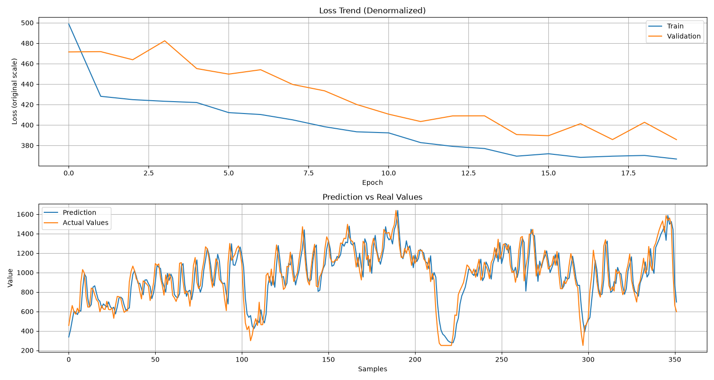

# AxLSTM: Modular LSTM Toolbox for Time Series Forecasting

[](https://www.python.org/downloads/)
[](https://keras.io/)
[](https://tensorflow.org/)
[](https://www.apache.org/licenses/LICENSE-2.0)

**AxLSTM** is a self-contained, modular Python toolbox engineered for building, training, and evaluating Long Short-Term Memory (**LSTM**) neural networks on univariate time series. It encapsulates an end-to-end pipeline—from raw data ingestion, outlier cleaning, and sliding-window featurization to multi-layer model compilation, EarlyStopping training, and denormalized visualization.

The repository includes:
1. **`src/ax_lstm/AxLSTM.py`**: The core, reusable object-oriented engine and LSTM pipeline.
2. **`test/Test_LSTM.py`**: A fully configurable CLI script demonstrating model training, evaluation, and dashboard generation on sample time series data.
3. **`test/Test.txt`**: Sample univariate time series data in TSV format.

---

## Table of Contents

- [Overview & Architecture](#overview--architecture)
- [Key Features](#key-features)
- [Explanations of key LSTM concepts](doc/LSTM.md)
- [Project Structure](#project-structure)
- [Installation & Setup](#installation--setup)
- [Quick Start: Running the CLI Script](#quick-start-running-the-cli-script)
  - [Command-Line Arguments](#command-line-arguments)
  - [Examples](#examples)
  - [Example Output](#example-output)
- [Programmatic API Usage](#programmatic-api-usage)
- [Configuration Reference](#configuration-reference)
- [License](#license)

---

## Overview & Architecture

Predicting time series with recurrent networks typically requires repetitive, error-prone data transformations (handling chronological splits, managing lag windows, scaling, and adjusting tensor dimensions for mini-batch divisibility).

`AxLSTM` abstracts this workflow into an intuitive, modular object-oriented API:

```text
Raw Data (CSV / TSV)
       │
       ▼
1. Load & Drop Date Column
       │
       ▼
2. Outlier Cleaning (Clip or Drop thresholds)
       │
       ▼
3. Normalization (MinMaxScaler fit on training target)
       │
       ▼
4. Chronological Train / Validation Split (No lookahead leakage)
       │
       ▼
5. Sliding-Window Featurization (Lags x0..x_{k-1} -> Target Y)
       │
       ▼
6. Symmetric Batch-Size Trimming (Clean division by batch_size)
       │
       ▼
7. 3D Tensor Reshaping: (samples, time_steps, 1)
       │
       ▼
8. Multi-layer Stacked LSTM + Dropout Regularization (Keras 3)
       │
       ▼
9. Training with EarlyStopping & Cross-Platform Progress
       │
       ▼
10. Evaluation & Unified Denormalized Dashboard Plotting
```

---

## Key Features

- **Modern Keras 3 Standalone**: Built on `keras` 3 with explicit `keras.layers.Input` specifications, making it multi-backend ready and fully compliant with modern deep learning standards.
- **End-to-End Automated Preprocessing (`load_and_prepare`)**:
  - Handles CSV/TSV data with configurable delimiters.
  - Optional outlier handling via clipping (`clip`) or record removal (`drop`).
  - Strict chronological splitting (prevents future information from leaking into training).
  - Configurable sliding window (`time_steps`).
  - Automatic symmetrical batch trimming so dataset dimensions match Keras mini-batch constraints.
- **Flexible Network Architecture (`build_model`)**:
  - **Unidirectional LSTM**: Mathematically sound for causal time series forecasting (no bidirectional future lookahead).
  - **Configurable Stacking**: Accepts any number of stacked LSTM layers via a simple list (e.g., `units=[64, 32]`), automatically managing `return_sequences`.
  - **Regularization**: Inter-layer `Dropout` to prevent overfitting.
  - **Stateful Support**: Optional stateful mode with manual state resetting per epoch.
- **Robust Training & Callbacks (`train`)**:
  - `EarlyStopping` monitoring `val_loss` with configurable patience and automatic restoration of best weights (`restore_best_weights=True`).
- **Domain-Aware Visualization (`plot_*`)**:
  - **Denormalized Loss Curve**: Converts MSE back into the original data scale via inverse scaling.
  - **Prediction vs. Ground Truth**: Compares model inferences against actual validation points.
  - **Unified Dashboard (`plot_dashboard`)**: Generates a two-panel figure combining loss evolution and predictions.
- **Cross-Platform**: Fully compatible with Linux, macOS, and Windows.

---

## Project Structure

```text
AxLSTM/
├── src/
│   └── ax_lstm/
│       ├── __init__.py     # Public package export
│       └── AxLSTM.py       # Core library: preprocessing, model building, training, plotting
├── test/
│   ├── Test_LSTM.py       # CLI execution script and reference example
│   └── Test.txt           # Sample univariate time series dataset (TSV)
├── doc/
│   └── LSTM.md            # Theoretical background and key LSTM concepts
├── pyproject.toml         # Package metadata and build configuration
├── requirements.txt       # Python package dependencies
└── README.md              # Documentation
```

---

## Installation & Setup

### 1. Prerequisites
- Python 3.10 or higher.
- A virtual environment is recommended.

### 2. Create and Activate Virtual Environment

**On Windows (PowerShell):**
```powershell
python -m venv .venv
.\.venv\Scripts\Activate.ps1
```

**On Linux / macOS:**
```bash
python3 -m venv .venv
source .venv/bin/activate
```

### 3. Install the Package

From the repository root, install AxLSTM and its dependencies:

```bash
pip install --upgrade pip
pip install .
```

For development, install the package in editable mode:

```bash
pip install -e .
```

---

## Quick Start: Running the CLI Script

The script `test/Test_LSTM.py` provides a ready-to-use command-line interface to train and test the LSTM network on your data. Run it from the repository root:

Run a quick test with 10 epochs:
```bash
python test/Test_LSTM.py --epochs 10
```

### Command-Line Arguments

| Argument | Type | Default | Description |
|---|:---:|:---:|---|
| `--data` | `str` | *Auto-detected* | Path to CSV/TSV time series file |
| `--delimiter` | `str` | `\t` | File delimiter (use `\t` for tab, `,` for comma) |
| `--target-col` | `str` | `y` | Name of the target column |
| `--date-col` | `str` | `data` | Date column name to drop if present |
| `--clean-mode` | `str` | `clip` | Cleaning method: `clip`, `drop`, or `none` |
| `--clean-lower` | `float` | `250.0` | Lower outlier bound |
| `--clean-upper` | `float` | `1950.0` | Upper outlier bound |
| `--time-steps` | `int` | `7` | Sliding window sequence length (lags) |
| `--split-value` | `int` | `5` | Validation split denominator (e.g., 5 $\to$ 20% validation) |
| `--batch-size` | `int` | `32` | Mini-batch size |
| `--units` | `int+` | `64 32` | Number of neurons per stacked LSTM layer |
| `--dropout` | `float` | `0.2` | Dropout rate between LSTM layers |
| `--learning-rate` | `float` | `0.001` | Learning rate for Adam optimizer |
| `--stateful` | `flag` | `False` | Enable stateful LSTM mode |
| `--epochs` | `int` | `100` | Maximum number of training epochs |
| `--patience` | `int` | `10` | EarlyStopping patience on `val_loss` (0 to disable) |
| `--no-plot` | `flag` | `False` | Suppress display of matplotlib graphical dashboard |

### Examples

**Train with a custom architecture (3 stacked layers: 128 -> 64 -> 32) and 50 epochs:**
```bash
python test/Test_LSTM.py --epochs 50 --units 128 64 32 --dropout 0.3
```

**Train without outlier clipping on a custom CSV file:**
```bash
python test/Test_LSTM.py --data my_series.csv --delimiter "," --clean-mode none --epochs 30
```

**Headless run for automated environments (no GUI plot display):**
```bash
python test/Test_LSTM.py --epochs 20 --no-plot
```

### Example Output

At the completion of the training pipeline, `test/Test_LSTM.py` displays a unified dashboard illustrating both the loss convergence in real data units and the model's predictions compared against ground truth validation data:



---

## Programmatic API Usage

You can easily import and embed `AxLSTM` into your own scripts, notebooks, or services:

```python
from ax_lstm import AxLSTM

# 1. Define hyperparameters
config = {
    'time_steps': 7,                 # 7 past time steps to predict the next value
    'split_value': 5,                # 1/5 (20%) reserved for validation
    'batch_size': 32,                # Mini-batch size
    'units': [64, 32],               # 2 stacked LSTM layers with 64 and 32 units
    'dropout': 0.2,                  # 20% dropout between layers
    'learning_rate': 0.001,          # Adam optimizer learning rate
    'stateful': False,               # Stateless LSTM
    'early_stopping_patience': 10,   # Stop if val_loss does not improve for 10 epochs
    'norm_min': 0.0,                 # MinMaxScaler lower bound
    'norm_max': 1.0,                 # MinMaxScaler upper bound
}

# 2. Instantiate pipeline
lstm = AxLSTM(config)

# 3. Ingest and prepare data
lstm.load_and_prepare(
       filepath='test/Test.txt',
    delimiter='\t',
    target_col='y',
    clean_mode='clip',
    clean_lower=250.0,
    clean_upper=1950.0,
    verbose=True
)

# 4. Build and compile model
lstm.build_model(verbose=True)

# 5. Train model
history = lstm.train(epochs=50, shuffle=True, verbose=1)

# 6. Evaluate performance
metrics = lstm.evaluate()
print(f"Train MSE: {metrics['train_loss']:.6f} | Val MSE: {metrics['val_loss']:.6f}")

# 7. Generate inferences
predictions = lstm.predict()  # Predicts on validation set by default
# Denormalize predictions back to original physical units
real_scale_preds = lstm.denormalize(predictions)

# 8. Visualize unified dashboard
lstm.plot_dashboard(
    title_history='Loss Trend (Original Scale)',
    title_predictions='Predictions vs Actual Values'
)
```

---

## Configuration Reference

The `config` dictionary passed to `AxLSTM(config)` supports the following parameters:

| Key | Type | Default | Description |
|---|:---:|:---:|---|
| `time_steps` | `int` | `7` | Length of the sliding temporal window (number of historical observations used as input). |
| `split_value` | `int` | `5` | Validation fraction denominator ($N_{val} = N_{total} // \text{split\_value}$). |
| `batch_size` | `int` | `32` | Number of samples per gradient update. |
| `units` | `list[int]` | `[64]` | Neurons for each LSTM layer. If length > 1, intermediate layers set `return_sequences=True`. |
| `dropout` | `float` | `0.2` | Dropout probability between consecutive recurrent layers. |
| `learning_rate`| `float` | `0.001` | Initial learning rate for the Adam optimizer. |
| `stateful` | `bool` | `False` | If `True`, hidden state is preserved across batches and manually reset each epoch. |
| `early_stopping_patience` | `int` | `0` | Epochs without improvement before stopping training (0 disables early stopping). |
| `norm_min` | `float` | `0.0` | Target lower boundary for `MinMaxScaler`. |
| `norm_max` | `float` | `1.0` | Target upper boundary for `MinMaxScaler`. |

---


## License

This project is dual-licensed:

- **Open Source**: [Apache License 2.0](LICENSE)
- **Commercial**: [Commercial License](doc/LICENSE-COMMERCIAL.md)

You may use this project under the terms of the Apache License 2.0.  
If you need a commercial license please see the [Commercial License](doc/LICENSE-COMMERCIAL.md) 